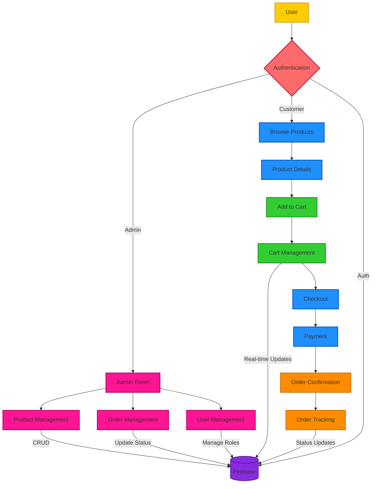

# ShopSphere | Flutter-Powered eCommerce Platform


A feature-rich e-commerce application built with Flutter and Firebase, implementing Clean Architecture principles. This project serves as a learning implementation of clean code practices, SOLID principles, and modern app development patterns.

## 🎯 Project Overview

ShopSphere is a demonstration project showcasing the implementation of Clean Architecture in a Flutter application. While not production-ready, it implements core e-commerce functionalities following best practices and modern development patterns.

## 🏗️ Architecture

The project follows Clean Architecture principles, separating the codebase into distinct layers:

### Layers
- **Domain Layer**: Contains business logic and entities
- **Data Layer**: Implements repositories and data sources
- **Presentation Layer**: Houses UI components and state management (BLoC)

### Design Patterns & Principles
- **SOLID Principles**
- **Dependency Injection** (using get_it)
- **Repository Pattern**

## ✨ Features

### 🔐 Authentication
- Dual role support (Admin/Customer)
- Email & Password authentication
- Form validation
- Secure session management

### 🛍️ Shopping Experience
- Product browsing with infinite scroll
- Category filtering
- Product details with expandable description
- Image carousel for product photos

### 🛒 Cart Management
- Add/Remove items
- Quantity adjustment
- Real-time price calculation
- Persistent cart state

### 💳 Checkout & Payment
- Address management
- Order summary
- Payment method selection
- Order confirmation

### 📦 Order Management
- Order tracking
- Order history
- Order status updates
- Order details view

### 👨‍💼 Admin Panel
- Product management (CRUD operations)
- Order management
- User management
- Analytics dashboard


## App Flow


## 🛠️ Technical Stack

### Core
- **Flutter**: UI framework
- **Firebase**: Backend services
  - Firebase Auth
  - Cloud Firestore
  - Firebase Storage

### State Management & Architecture
- **provider**: State management
- **get_it**: Dependency injection
- **equatable**: Value equality
- **freezed**: Code generation
- **dartz**: Functional programming

### Utils
- **internet_connection_checker**: Network connectivity
- **image_picker**: Image selection
- **formz**: Form validation


## 🚀 Getting Started

1. Clone the repository
```bash
git clone https://github.com/ShishirRijal/shopsphere.git
```

2. Install dependencies
```bash
flutter pub get
```

3. Configure Firebase
   - Create a new Firebase project
   - Add Android/iOS apps in Firebase console
   - Download and add configuration files
   - Enable Authentication and Firestore

4. Run the app
```bash
flutter run
```


## App Snaps
### Admin 
  
    
   
   
   
   
   
   


 ### Customer
 
                          


## 🤝 Contributing

While this is a learning project, suggestions and discussions about architectural improvements are welcome! Feel free to:
- Open issues for discussions
- Submit PRs for improvements
- Share feedback about the architecture

## 📝 License

This project is released under the MIT License.

---
Built with ❤️ by Shishir Rijal


 

 
